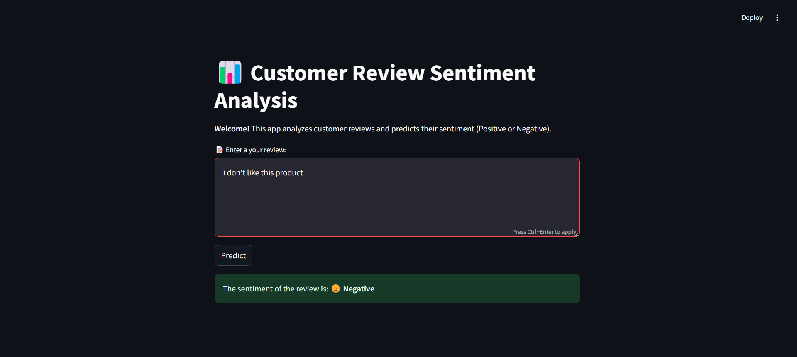

# Sentiment Analysis MLOps Project 🚀

## Table of Contents 📑
- [Introduction](#-Introduction)
- [Deployment Pipelines](#-Deployment-Pipelines)
- [Tech Stack](#-Tech-Stack)
- [Local Setup](#-Local-Setup-and-Installation)
- [Zenml Integration](#-Zenml-Integration)
- [Running the Project](#-Running-the-Project)

## Introduction 📢
This project automates sentiment analysis to classify customer reviews as **positive** or **negative**, helping businesses understand feedback effectively while ensuring accurate model deployment and real-time predictions through cutting-edge **MLOps tools**. It integrates powerful tools like **ZenML** for pipeline management, **MLflow** for model deployment and experiment tracking, **PostgreSQL** for data ingestion, and **Streamlit** for an interactive interface, ensuring efficiency and scalability.

**It features:**

- A **Training Pipeline** that ingests data, preprocesses, vectorizes it, trains the model, and evaluates the results.
- A **Continuous Deployment Pipeline** that trains and (re)deploys the model automatically.
- An **Inference Pipeline** that enables real-time sentiment predictions through a user-friendly Streamlit interface.

## Deployment Pipelines
### 1. **Training Pipeline** 🚂
Our standard training pipeline consists of several steps:

- **ingest_data**: Fetches data from a PostgreSQL table into a pandas DataFrame.
- **data_preprocessing_step**: The raw data undergoes rigorous preprocessing. This includes:

   - Cleaning text data by removing HTML tags, URLs, and special characters.
   - Expanding contractions and converting text to lowercase.
   - Removing stopwords and lemmatizing words for better feature extraction.
   - Filtering out neutral reviews and labeling data for classification tasks.
- **data_sampling_step**: This step balances the dataset by sampling an equal number of positive and negative reviews.
- **data_splitter_step**: This step splits the balanced dataset into training and testing subsets.
- **vectorization**: The text data is converted into numerical format using techniques like TF-IDF making it ready for model training.
- **model_training_step**: This step will train the model and save the model using [MLflow autologging](https://www.mlflow.org/docs/latest/tracking.html).
- **model_evaluation_step**: This step will evaluate the model and save the metrics — using **MLflow autologging** — into the artifact store.


### 2. **Continuous Deployment Pipeline** 🔄
This pipeline is here to make your life easier! It automatically handles the deployment of your best-performing model, ensuring the entire process — from training to serving — is smooth and efficient. By continuously checking model performance, it (re)deploys only the
top-performing versions, keeping your production environment optimized, scalable, and ready to handle real-world data seamlessly.


### 3. **Inference Pipeline** 🧠
The inference pipeline is all about making predictions effortless! It loads the deployed model service from **MLflow** and processes new input data to generate predictions seamlessly. Designed for real-time predictions, this pipeline ensures your production system is always ready to deliver accurate results quickly and efficiently.


## Teck Stack 🛠️
- **PostgreSQL**: Ensures robust and efficient data ingestion and management.
- **ZenML**: Manages MLOps pipelines for seamless integration and automation.
- **MLflow**: Handles experiment tracking and deploys the trained models effortlessly.
- **Streamlit**: Powers the front end, offering an intuitive and interactive user interface.

### Table Structure in PostgreSQL 


### Using MLFlow for Model Deployer & Experiment Tracker with ZenML


### Streamlit


## Local Setup 👨🏼‍💻
1. **Clone the Repository**:
```bash
git clone https://github.com/karthikponna/sentiment_analysis_MLOps.git
cd sentiment_analysis_MLOps
```

2. **Set Up a Virtual Environment**:
```bash
# For macOS and Linux:
python3 -m venv venv

# For Windows:
python -m venv venv
```

3. **Activate the Virtual Environment**:
```bash
# For macOS and Linux:
source venv/bin/activate

# For Windows:
.\venv\Scripts\activate
```

4. **Install Required Dependencies**:
```bash
pip install -r requirements.txt
```

## Zenml Integration 💥
1. Install ZenML - https://docs.zenml.io/getting-started/installation 

2. Install some integrations using ZenML:
```bash
zenml integration install mlflow -y
```

3. Register mlflow in the stack:
```bash
zenml integration install mlflow -y
zenml experiment-tracker register mlflow_tracker --flavor=mlflow
zenml model-deployer register mlflow --flavor=mlflow
zenml stack register local-mlflow-stack -a default -o default -d mlflow -e mlflow_tracker --set
```

## Running the Project 🏃‍➡️

Follow these steps to run different components of the project:

1. **Training Pipeline**:
   
   ```bash
    python run_pipeline.py
    ```

2. **Continuous Integration Pipeline**:

   ```bash
    python run_deployment.py --config deploy
    ```

3. **Inference Pipeline**:

   ```bash
    python run_deployment.py --config predict
    ```

4. **Streamlit**:

   ```bash
    streamlit run streamlit_app.py
    ``` 
